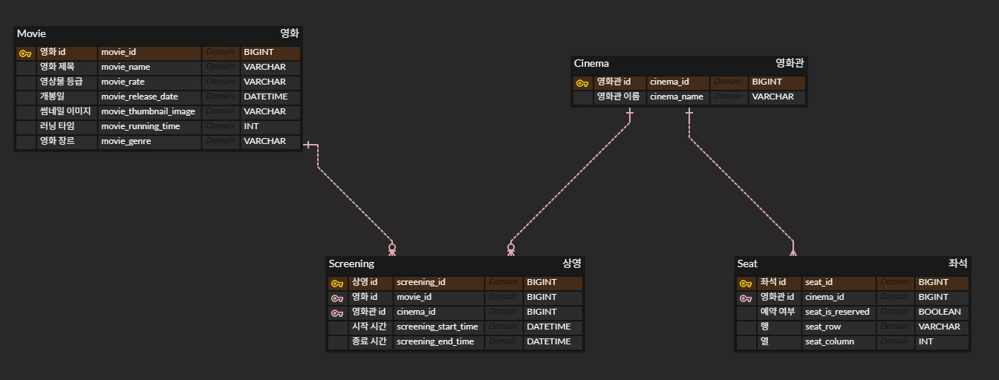

# Redis_project  

커머스의 핵심 프로세스인 상품 조회 및 주문 과정에서 발생할 수 있는 동시성 이슈 해결 및 성능 개선을 경험하고, 안정성을 높이기 위한 방법을 배웁니다.

## Multi Module Design

 

**의존 관계**
- presentation -> application
- application -> domain, infrastructure
- infrastructure -> domain

 

**모듈별 역할**
- presentation 모듈
  - controller 역할
  - 요청을 받음
  - application 모듈의 service에 필요한 로직 호출
  - application 모듈의 service로부터 받은 결과를 응답

- application 모듈
  - service 역할
  - 필요한 비즈니스 로직 수행

- domain 모듈
  - 도메인 클래스들 모인 곳
  - 도메인 클래스의 로직 담당

- infrastructure 모듈
  - repository 역할
  - DB와 관련된 것 (entity, repository)가 존재
  - entity to domain 해주는 mapper 존재
  - application과 infrastructure간 중간 역할인 adapter 존재

 

## Table Design
**ERD**

 

**테이블 간 관계**
- Movie 테이블 - Screening 테이블 = 1 : N
- Screening 테이블 - Cinema 테이블 = 1 : N
- Cinema 테이블 - Seat 테이블 = 1 : N

  

Movie와 Cinema가 N : M 이라고 판단

따라서 중간 테이블인 Screening 테이블 생성

 

## Architecture
- Layered Architecture 적용
  - 따라서 presentation, application, domain, infrastructure 모듈로 구성
  - 상위 모듈만이 하위 모듈을 사용할 수 있도록 함